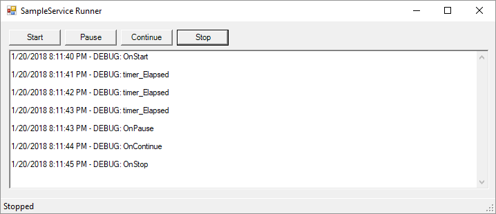

## ServiceHelper

Service Helper provides a helper class that allows for *easy debugging of Windows Services* during development.

### How do I use it?

* Simply download package from nuget
* Have your Windows Service inherit from DebuggableService and implement your service

### How do I use it?
Run your windows service with `/debug` and you get a Windows Runner that looks like the following:



Source comes with a sample project with DebuggableService configured

### Detailed Configuration Steps Below:

1. Create a Windows Forms App (.NET Framework) project
2. Delete the default Windows Form - typically called Form1.cs (or Form1.vb)
3. Add a Windows Service to project
4. Change Windows Service base class from ServiceBase to DebuggableService 
5. Add code snippet to launch your Windows Service

```
if (args.Length > 0 && args[0].ToLower().Equals("/debug"))
{
    Application.Run(new ServiceRunner(service));
}
else
{
    ServiceBase[] ServicesToRun;
    ServicesToRun = new ServiceBase[]
    {
        service
    };
    ServiceBase.Run(ServicesToRun);
}
```

Don't forget to configure log4net debug levels to appropriate levels - see app.config (in sample) or read more on [log4net website](https://logging.apache.org/log4net/release/manual/introduction.html)

*PS - DebuggableService derives from ServiceBase (so you can do anything you would normally do in your Windows Service)*